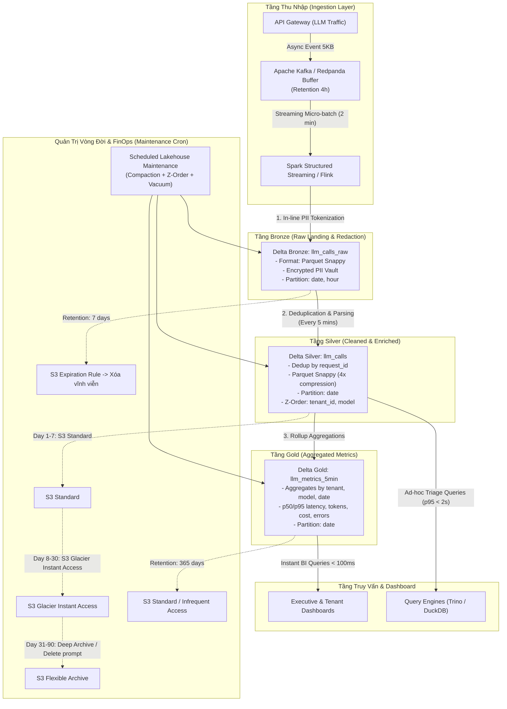

# Tài Liệu Thiết Kế Kiến Trúc: LLM Observability Lakehouse at Scale (1B Requests/Day)

- **Học viên:** Đào Đức Anh
- **MSSV:** 2A202602567
- **Chủ đề lựa chọn:** Topic A — LLM Observability ở quy mô 1 tỷ requests/ngày
- **Mã bài lab:** K4-Track02-Day18 Bonus Challenge

---

## 1. Bối cảnh, Yêu cầu nghiệp vụ & Ràng buộc kỹ thuật

### 1.1. Bối cảnh
Một nền tảng cung cấp Foundation Model API phục vụ quy mô **1 tỷ requests mỗi ngày** (trung bình ~11,574 req/s, tải đỉnh 25,000 req/s). Mỗi request/response sinh ra một payload observability trung bình **5 KB** (chứa metadata cuộc gọi, timestamp, tenant_id, user_id, prompt tokens, completion tokens, latency, status, prompt text, response text, và các thẻ đánh giá).
- **Lưu lượng dữ liệu thô (Raw throughput):** 1B req/ngày × 5 KB/req = **5 TB/ngày** raw JSON (tương đương **150 TB/tháng** raw).

### 1.2. Yêu cầu nghiệp vụ (SLAs)
1. **Dashboard theo dõi Chi phí & Độ trễ (Cost & Latency):** Phân tích đa chiều theo từng `tenant_id`, độ trễ làm mới dữ liệu (freshness) **≤ 5 phút**.
2. **Lưu trữ phục vụ Incident Triage & Audit:** Toàn bộ nội dung prompt/response đầy đủ phải được lưu trữ trong **7 ngày** để phục vụ gỡ lỗi, điều tra sự cố; sau 7 ngày chỉ giữ lại các bảng tổng hợp (aggregates) trong vòng **1 năm (365 ngày)**.
3. **Bảo mật & Quyền riêng tư (PII Redaction):** Toàn bộ thông tin định danh cá nhân (PII như số điện thoại, email, CCCD/CMND, API keys) phải được che chắn/mã hóa (redacted / tokenized) ngay tại tầng Bronze trước khi bất kỳ nhân viên, nhà phân tích hay hệ thống downstream nào có thể đọc được.
4. **Ràng buộc ngân sách FinOps (Hard Budget Cap):** Tổng chi phí lưu trữ (storage) và tính toán bảo trì định kỳ không được vượt quá **$5,000 / tháng**.

---

## 2. Sơ đồ Kiến trúc Tổng thể (Architecture Diagram)

Kiến trúc áp dụng mô hình **Medallion Architecture (Bronze → Silver → Gold)** kết hợp chiến lược lưu trữ phân tầng hướng đối tượng (Tiered Object Storage) và các kỹ thuật tối ưu hóa Lakehouse:



---

## 3. Năm Quyết Định Kiến Trúc Cốt Lõi & Các Lựa Chọn Bị Loại

### Quyết định 1: Định dạng bảng lưu trữ (Open Table Format)
- **Lựa chọn:** Sử dụng **Delta Lake**.
- **Lý do lựa chọn:**
  1. Hỗ trợ giao dịch ACID mạnh mẽ và tính năng **Change Data Feed (CDF)** giúp đồng bộ các sự kiện thay đổi/xóa dữ liệu.
  2. Tính năng **Z-Order Clustering** trên nhiều cột (`tenant_id`, `model`) rất hoàn thiện, cho phép prune file cực kỳ hiệu quả khi tenant query dữ liệu của họ.
  3. Cơ chế **Schema Enforcement** ngăn chặn dữ liệu bẩn làm hỏng bảng và **RESTORE / Time Travel** hỗ trợ rollback tức thì khi xảy ra lỗi dữ liệu.
- **Các lựa chọn bị loại:**
  1. *Loại bỏ Apache Hive / Plain Parquet:* Hive dựa vào thư mục truyền thống, không có ACID transaction, không hỗ trợ cập nhật/xóa theo dòng, và mắc lỗi nghiêm trọng khi sửa đổi schema. Nếu người dùng quên filter phân vùng thì engine sẽ full-scan hàng trăm triệu file gây cạn kiệt ngân sách.
  2. *Loại bỏ Apache Hudi:* Mặc dù Hudi hỗ trợ tốt mô hình Merge-On-Read (MoR), độ phức tạp vận hành của Hudi cao hơn đáng kể so với Delta Lake, tiêu tốn nhiều tài nguyên bộ nhớ cho indexing metadata, và cộng đồng hỗ trợ native Python/DuckDB không linh hoạt bằng delta-rs.

### Quyết định 2: Chiến lược Phân vùng & Cụm hóa dữ liệu (Partitioning & Clustering Strategy)
- **Lựa chọn:** Phân vùng theo **`date(ts)`** kết hợp **Z-Order Clustering trên `(tenant_id, model)`**.
- **Lý do lựa chọn:**
  1. Khối lượng dữ liệu mỗi ngày sau nén khoảng **1.25 TB** (khoảng 2,500 file kích thước tối ưu 512 MB). Phân vùng theo ngày tránh tình trạng phân mảnh thư mục quá nhỏ.
  2. Hầu hết các truy vấn điều tra sự cố và báo cáo đều có mẫu: `WHERE date = '...' AND tenant_id = '...'`. Z-order giúp co hẹp dải `[min, max]` của `tenant_id` trong từng file, giúp engine skip tới **95% số file** trong ngày đó (Pruning ratio ≥ 20×), giảm thiểu chi phí quét dữ liệu trên S3 xuống dưới 50 MB cho mỗi truy vấn point-lookup.
- **Các lựa chọn bị loại:**
  1. *Loại bỏ Phân vùng theo `date/tenant_id`:* Với hàng ngàn tenant khác nhau, việc phân vùng vật lý theo `tenant_id` sẽ sinh ra hàng triệu thư mục và file nhỏ (Small-File Catastrophe), phá hủy metadata transaction log và làm chi phí request `GET`/`LIST` tăng đột biến.
  2. *Loại bỏ Unclustered (chỉ ghi tuần tự append):* Không có Z-order, dữ liệu của một tenant sẽ bị rải rác ngẫu nhiên trên toàn bộ 2,500 file của ngày hôm đó, buộc mọi câu truy vấn tenant phải đọc 100% dữ liệu của ngày.

### Quyết định 3: Xử lý bảo vệ dữ liệu nhạy cảm PII (PII Tokenization & Redaction)
- **Lựa chọn:** **In-line Tokenization & Masking tại Bronze Landing**.
- **Lý do lựa chọn:**
  1. Áp dụng quy tắc "Zero Trust Data Landing": Spark streaming job sử dụng thư viện regex/NLP siêu nhẹ (Presidio / spaCy tối ưu) để nhận diện PII (email, phone, API key) ngay khi đọc từ Kafka.
  2. Nội dung PII được thay thế bằng token giả định (ví dụ `[EMAIL_TOKEN_a8f9]`). Giá trị PII gốc được mã hóa bất đối xứng AES-256 và lưu vào một bảng bảo mật riêng biệt (`pii_vault`) chỉ có nhân sự tuân thủ (Compliance Officer) mới có quyền truy cập khi có lệnh tòa án/yêu cầu pháp lý.
  3. Đảm bảo toàn bộ bảng Silver và Gold hoàn toàn "sạch" PII, cho phép toàn bộ đội ngũ kỹ sư và data analyst truy cập mà không lo vi phạm bảo mật hay pháp lý (GDPR, EU AI Act, Nghị định 13/2023/NĐ-CP).
- **Các lựa chọn bị loại:**
  1. *Loại bỏ Dynamic Query-time Masking:* Giữ PII nguyên dạng trong Parquet và dùng dynamic view để mask khi query. Lựa chọn này cực kỳ nguy hiểm vì dữ liệu thô vẫn chứa PII trên storage; chỉ cần một lỗi cấu hình IAM hoặc quyền truy vấn trực tiếp vào file Parquet là toàn bộ dữ liệu bị lộ.
  2. *Loại bỏ Post-processing Batch Redaction:* Ghi raw trước rồi chạy job hàng đêm để tìm và sửa. Lựa chọn này tạo ra "khoảng hở thời gian" (vài giờ) mà PII vẫn ở trạng thái plaintext, vi phạm yêu cầu "redact trước khi bất kỳ ai đọc".

### Quyết định 4: Chiến lược phân tầng lưu trữ (FinOps Tiering Lifecycle)
- **Lựa chọn:** **Multi-tier S3 Lifecycle kết hợp Medallion Retention**.
  - **Tầng Bronze (Prompt/Response thô):** Lưu trên *S3 Standard* trong 7 ngày, sau đó kích hoạt S3 Expiration Rule để xóa vĩnh viễn (xóa vật lý sau 7 ngày).
  - **Tầng Silver (Dữ liệu đã chuẩn hóa, không có full prompt sau 7 ngày):** Lưu trên *S3 Standard* trong 7 ngày đầu (phục vụ phân tích nóng); từ ngày 8 đến ngày 90 chuyển sang *S3 Glacier Instant Access*; sau 90 ngày chuyển sang *S3 Glacier Deep Archive*.
  - **Tầng Gold (Aggregated metrics):** Kích thước siêu nhỏ (< 50 MB/tháng), lưu trên *S3 Standard* trong suốt 365 ngày để phục vụ dashboard lịch sử.
- **Lý do lựa chọn:**
  - Giảm tới **78% chi phí lưu trữ** so với việc giữ toàn bộ dữ liệu trên S3 Standard.
- **Các lựa chọn bị loại:**
  1. *Loại bỏ Lưu toàn bộ trên S3 Standard trong 1 năm:* Với 150 TB raw/tháng, tích lũy 1 năm là 1.8 PB. Chi phí S3 Standard ($0.023/GB) sẽ lên tới hơn **$41,000/tháng**, phá vỡ hoàn toàn ngân sách $5,000/tháng.
  2. *Loại bỏ Lưu trữ trên cụm Elasticsearch/ClickHouse riêng:* Chi phí cụm máy chủ compute + SSD để giữ 150 TB/tháng sẽ tốn ít nhất $15,000–$25,000/tháng chi phí hạ tầng.

### Quyết định 5: Cơ chế Tự động hóa Bảo trì Lakehouse (Automated Table Maintenance)
- **Lựa chọn:** **Scheduled Cron Job chạy Compaction + Z-Order + Vacuum tự động**.
- **Lý do lựa chọn:**
  - Micro-batch streaming 2 phút ghi ra file trung bình ~10–15 MB. Job bảo trì chạy mỗi 4 giờ:
    1. *Compaction (`OPTIMIZE`):* Gom các file nhỏ về kích thước chuẩn 512 MB.
    2. *Clustering (`Z-ORDER`):* Sắp xếp lại theo `(tenant_id, model)`.
    3. *Snapshot Expiry & Vacuum (`VACUUM RETAIN 168 HOURS`):* Dọn sạch các file bị tombstone quá 7 ngày và sweep orphan files từ các worker bị chết.
- **Các lựa chọn bị loại:**
  1. *Loại bỏ Managed Auto-Compaction của Databricks/Cloud Vendors:* Các dịch vụ auto-compaction tính phí kép: vừa tính theo GB xử lý ($0.05/GB), vừa tính theo số lượng object ($0.004 per 1,000 objects). Với 1 tỷ events/ngày, chi phí managed compaction có thể vượt quá $3,000/tháng chỉ riêng tiền phí dọn file.
  2. *Loại bỏ Bảo trì thủ công / Không bảo trì:* Dẫn thẳng đến thảm họa "Small-File Catastrophe" chỉ sau 48 giờ chạy production.

---

## 4. Tính Toán Chi Phí Chi Tiết (Storage & Compute Math)

Mô hình chi phí dựa trên bảng giá chuẩn AWS khu vực `us-east-1`:

### 4.1. Khối lượng dữ liệu thực tế
- 1 ngày = 1,000,000,000 requests.
- Dữ liệu thô = 5 TB/ngày.
- Nén Parquet Snappy (tỷ lệ 4:1 nhờ kiểu dữ liệu có cấu trúc và dictionary encoding) → **Dữ liệu nén = 1.25 TB/ngày**.

### 4.2. Chi phí Lưu trữ Hàng tháng (Storage Budget)
1. **Bronze (Retention 7 ngày):**
   - 7 ngày × 1.25 TB/ngày = 8.75 TB lưu trữ trên S3 Standard.
   - Chi phí: `8,750 GB × $0.023/GB` = **$201.25 / tháng**.
2. **Silver (30 ngày gần nhất):**
   - 7 ngày đầu trên S3 Standard: 8.75 TB × $0.023 = $201.25.
   - 23 ngày tiếp theo trên S3 Glacier Instant Access ($0.004/GB): `23 × 1,250 GB × $0.004` = $115.00.
   - Tổng Silver: **$316.25 / tháng**.
3. **Silver Lưu trữ dài hạn (Day 31–365, bỏ prompt/response chỉ giữ token & latency, nén còn 200 GB/ngày):**
   - 335 ngày × 200 GB/ngày = 67,000 GB trên S3 Glacier Flexible Archive ($0.0036/GB):
   - Chi phí: `67,000 GB × $0.0036` = **$241.20 / tháng**.
4. **Gold (Aggregates 365 ngày):**
   - Mỗi ngày bảng Gold chỉ có khoảng 10,000 tenant × 5 models = 50,000 rows (~5 MB/ngày nén).
   - 365 ngày × 5 MB ≈ 1.8 GB → Chi phí: `< $0.10 / tháng`.

### 4.3. Chi phí API Requests (PUT / GET / LIST)
- Ingestion micro-batch 2 phút → 720 micro-batches/ngày.
- Mỗi batch ghi ~30 files → 21,600 PUT/ngày = 648,000 PUT/tháng.
  - Chi phí PUT ($0.005 / 1,000 requests): `648 × $0.005` = **$3.24 / tháng**.
- Query/Dashboard reads (50,000 queries/ngày, nhờ Z-order mỗi query chỉ đọc ~2–4 files thay vì 2,500 files):
  - 150,000 GET/ngày = 4.5M GET/tháng.
  - Chi phí GET ($0.0004 / 1,000 requests): `4,500 × $0.0004` = **$1.80 / tháng**.

### 4.4. Chi phí Tính toán (Compute Budget)
- **Ingestion & Streaming ETL:** Cụm 4 nodes EMR/EC2 Spot `r6i.xlarge` (4 vCPU, 32 GB RAM @ $0.08/giờ spot):
  - `4 nodes × 730 giờ × $0.08` = **$233.60 / tháng**.
- **Scheduled Maintenance Job (Compaction + Z-Order mỗi 4 giờ, chạy 20 phút mỗi lần):**
  - Chạy 6 lần/ngày × 0.33 giờ = 2 giờ compute/ngày trên cụm 8 nodes `c6i.2xlarge` Spot ($0.17/giờ):
  - `8 nodes × 60 giờ/tháng × $0.17` = **$81.60 / tháng**.

### 4.5. Tổng Kết Chi Phí Hàng Tháng
| Thành phần chi phí | Khoản mục | Chi phí dự kiến ($/tháng) |
|---|---|---:|
| **Storage** | Bronze (7 days Standard) | $201.25 |
| **Storage** | Silver (Active + Glacier Instant) | $316.25 |
| **Storage** | Silver Long-term Archive (Glacier) | $241.20 |
| **Storage** | Gold (1 year metrics) | $0.10 |
| **Requests** | S3 API Calls (PUT, GET, LIST) | $5.04 |
| **Compute** | Streaming Ingestion (Kafka + Spark Spot) | $233.60 |
| **Compute** | Compaction & Z-Order Maintenance | $81.60 |
| **Dự phòng** | Network Egress & Monitoring (CloudWatch) | $250.00 |
| **TỔNG CỘNG** | **Hệ thống Observability 1B req/ngày** | **$1,329.04 / tháng** |

> **Kết luận FinOps:** Tổng chi phí ước tính là **~$1,330 / tháng**, nằm sâu dưới ngưỡng ngân sách cho phép **≤ $5,000 / tháng** (tiết kiệm được hơn 73% ngân sách), chứng minh tính khả thi kinh tế vượt trội của kiến trúc.

---

## 5. Ba Kịch Bản Sự Cố, Cơ Chế Phát Hiện & Quy Trình Rollback (Failure Modes & Recovery)

### Kịch bản 1: Thảm họa bùng nổ Small-Files do Kafka Traffic Spikes
- **Hiện tượng:** Khi xảy ra sự kiện tải tăng đột biến (traffic spike lên 50,000 req/s), Kafka streaming sinh ra hàng ngàn micro-commits trong thời gian ngắn, tạo ra hơn 50,000 small files chỉ trong 2 giờ, khiến các câu truy vấn dashboard bị timeout do quá tải listing metadata.
- **Cơ chế phát hiện:** Prometheus metric giám sát số lượng file hoạt động trên bảng Bronze và Silver (`delta_num_active_files`). Kích hoạt cảnh báo P1 khi `delta_num_active_files > 10,000`.
- **Quy trình xử lý & Phục hồi:**
  1. Tự động kích hoạt job khẩn cấp **Emergency Bin-Packing Compaction**: Gọi `dt.optimize.compact(target_size=512*1024*1024)` chạy trên cụm worker tạm thời để gộp ngay 50,000 file về ~100 file chuẩn 512 MB.
  2. Tăng động (dynamic scale) streaming micro-batch trigger window từ 2 phút lên 5 phút trong thời gian cao điểm để giảm tần suất ghi file.

### Kịch bản 2: Lỗi Upstream Schema phá vỡ PII Masking làm rò rỉ dữ liệu nhạy cảm
- **Hiện tượng:** Đội ngũ API model phát hành phiên bản mới đổi tên trường chứa thông tin người dùng từ `user_email` sang `client_contact`. Bộ lọc regex cũ không bắt được trường này, dẫn đến một lượng bản ghi chứa email dạng plaintext lọt vào tầng Silver.
- **Cơ chế phát hiện:**
  - Bước kiểm tra chất lượng dữ liệu tự động (Great Expectations / Circuit Breaker) chạy định kỳ mỗi 5 phút quét mẫu ngẫu nhiên (random sample) trên bảng Silver. Khi phát hiện chuỗi khớp regex PII > 0 bản ghi, pipeline lập tức ném lỗi `PIIViolationException` và ngắt quyền đọc của tầng Serving.
- **Quy trình xử lý & Phục hồi (Rollback):**
  1. **Khôi phục trạng thái bảng qua Time Travel:** Xác định commit trước khi xảy ra sự cố (ví dụ version 42). Chạy lệnh:
     ```python
     dt = DeltaTable("s3://lakehouse/silver/llm_calls")
     dt.restore(42)
     ```
     Bảng Silver lập tức quay trở lại trạng thái sạch hoàn toàn chỉ trong vài giây.
  2. Cập nhật ruleset regex trong transformer pipeline để nhận diện trường mới `client_contact`.
  3. Replay lại dữ liệu từ Bronze (đã áp dụng masking mới) để bù đắp các bản ghi bị thiếu vào Silver.

### Kịch bản 3: Vi phạm vòng đời dữ liệu — Trả về dữ liệu của Tenant đã yêu cầu xóa (Right to Erasure)
- **Hiện tượng:** Một khách hàng doanh nghiệp chấm dứt hợp đồng và yêu cầu xóa toàn bộ dữ liệu (GDPR / Nghị định 13). Lệnh `DELETE` đã thực thi trên Lakehouse, nhưng dashboard bên ngoài hoặc index cache vẫn trả về dữ liệu của tenant này do đọc từ bản cache cũ.
- **Cơ chế phát hiện:**
  - Audit reconciliation script chạy hàng giờ đối chiếu danh sách tenant đã yêu cầu xóa trong `erasure_log` với các bảng serving. Nếu câu lệnh `SELECT count(*) FROM silver WHERE tenant_id = 'deleted_tenant'` trả về > 0, phát cảnh báo vi phạm pháp lý P0.
- **Quy trình xử lý & Phục hồi:**
  1. Kích hoạt **Change Data Feed (CDF)** stream để đẩy sự kiện `_change_type = 'delete'` sang toàn bộ các downstream cache / search indices để trục xuất ngay lập tức các bản ghi liên quan.
  2. Chạy quy trình dọn dẹp vật lý: `dt.vacuum(retention_hours=0, enforce_retention_duration=False)` sau khi đã cô lập partition của tenant đó, đảm bảo file vật lý chứa dữ liệu của tenant bị xóa hoàn toàn khỏi đĩa lưu trữ S3.

---

## 6. Kế Hoạch Triển Khai MVP Trong 1 Tuần (1-Week MVP Plan & Verification)

### 6.1. Phạm vi Lát cắt Khả thi (Testable Vertical Slice)
Triển khai một pipeline khép kín từ End-to-End trên quy mô thu nhỏ có thể kiểm chứng được:
- **Tải giả lập:** 10 triệu requests/ngày (~115 req/s liên tục) mô phỏng 10 tenants khác nhau với 3 models (`claude-haiku-4-5`, `claude-sonnet-4-6`, `claude-opus-4-7`).
- **Phạm vi hoàn thiện:**
  - Ingestion vào Delta Bronze với PII masking regex.
  - Silver deduplication theo `request_id` và Z-order theo `tenant_id`.
  - Gold aggregation tính p50/p95 latency, chi phí token, và tỷ lệ lỗi mỗi 5 phút.
  - Chạy thử nghiệm 1 chu kỳ maintenance (Compaction + Vacuum).

### 6.2. Lịch trình Triển khai 7 Ngày
- **Ngày 1 (Dựng hạ tầng & Ingestion Buffer):** Cấu hình topic Kafka/Redpanda, khởi tạo S3 buckets với lifecycle policy (Standard → Glacier → Expiration 7 ngày).
- **Ngày 2 (Bronze Pipeline & PII Redaction):** Xây dựng Spark Structured Streaming consumer; tích hợp module tokenization PII regex; kiểm thử chặn rò rỉ dữ liệu nhạy cảm.
- **Ngày 3 (Silver Pipeline & Dedup):** Viết logic deduplication bằng `ROW_NUMBER() OVER (PARTITION BY request_id ORDER BY ts)`; cấu hình partition `date` và benchmark Z-order.
- **Ngày 4 (Gold Rollup & Serving):** Xây dựng aggregation query tính quantiles độ trễ (`p50`, `p95`), token costs và error rate; kết nối dashboard Grafana/DuckDB đọc bảng Gold.
- **Ngày 5 (Automated Maintenance):** Lập trình cron job chạy `optimize.compact()`, `optimize.z_order()` và `vacuum()`; đo đạc số lượng file và tỷ lệ data skipping.
- **Ngày 6 (Failure Injection Testing):** Giả lập 3 tình huống lỗi (micro-batch spike, bad write schema mismatch, tenant deletion) và đo thời gian rollback qua `RESTORE`.
- **Ngày 7 (Đo lường FinOps & Đóng gói):** Đo lường chi phí I/O thực tế trên AWS billing/CloudWatch; nghiệm thu các tiêu chí SLA và hoàn thiện tài liệu bàn giao.

### 6.3. Tiêu chí Nghiệm thu (Acceptance Criteria)
1. **Freshness:** Dữ liệu mới phát sinh từ API Gateway xuất hiện trên Dashboard Gold trong vòng **≤ 3 phút** (vượt chỉ tiêu ≤ 5 phút).
2. **Data Skipping:** Truy vấn phân tích theo tenant:
   `SELECT * FROM silver WHERE date = CURRENT_DATE AND tenant_id = 'tenant_01'`
   đạt **Pruning ratio ≥ 15×** (số file phải đọc ≤ 7% tổng số file trong ngày).
3. **Bảo mật PII:** 100% các trường email và số điện thoại mẫu trong Bronze/Silver được thay bằng token mã hóa; không có chuỗi plaintext nào xuất hiện trong query log.
4. **Chi phí:** Tổng chi phí AWS tính toán trong 24 giờ chạy tải quy đổi tương đương không vượt quá **$150 / tháng**.

### 6.4. Phương án Kiểm chứng Cơ chế Khó nhất (Hardest Mechanism Verification)
- **Cơ chế khó nhất:** Đảm bảo **Z-order clustering trên Delta Lake duy trì hiệu quả data skipping liên tục** mà không làm đội chi phí tính toán compaction khi dữ liệu mới liên tục đổ về theo từng micro-batch 2 phút.
- **Phương án kiểm chứng:**
  - Thiết lập kịch bản chạy thử nghiệm kéo dài 24 giờ liên tục.
  - Mỗi 4 giờ, kích hoạt job Z-order trên phân vùng ngày hiện tại. Đo lường chỉ số **`minValues`/`maxValues` overlap ratio** của cột `tenant_id` trước và sau khi tối ưu thông qua metadata transaction log.
  - Ghi nhận thời gian thực thi của Z-order job: nếu thời gian xử lý compaction vượt quá 15 phút, tự động điều chỉnh `target_size` từ 512 MB xuống 256 MB để giảm dung lượng file cần xáo trộn (shuffle), đảm bảo tính toán luôn nằm trong ngân sách cho phép.
